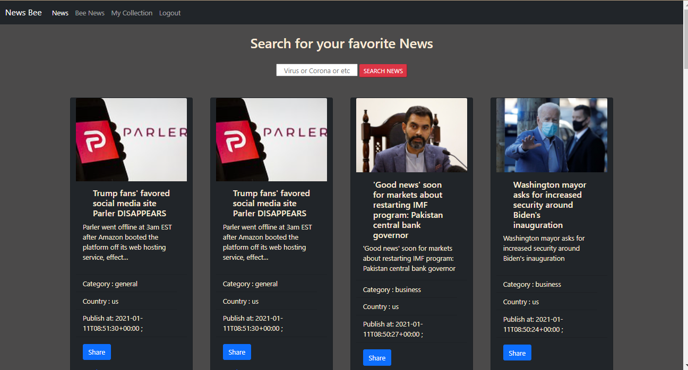

# NewsBee
 I'm going to create a small application called “News Bee”. News Bee will be a news readers hub where readers will read news about his country and the news which are shared by the other readers. If a reader finds a news interesting or important for people then he will share the news, similar like facebook share feature for a post.

# Deploy: AWS | Azure | Archive(Snap) 
[1] http://app.moshiurhridoy.me
[2] http://newsbee.eastus.cloudapp.azure.com/
[3] Snapshot of Login & Sign Up: [Login](https://web.archive.org/web/20210111094343/http://3.236.72.244/login/) & [SignUp](https://web.archive.org/web/20210111094343/http://3.236.72.244/signup/)
# Home Page

# My Collections

